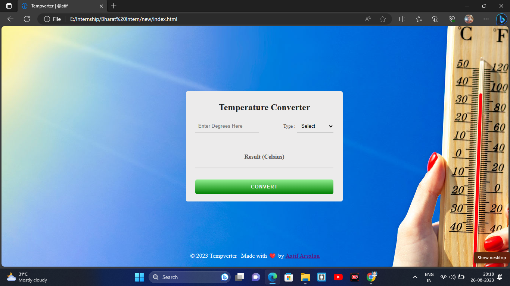
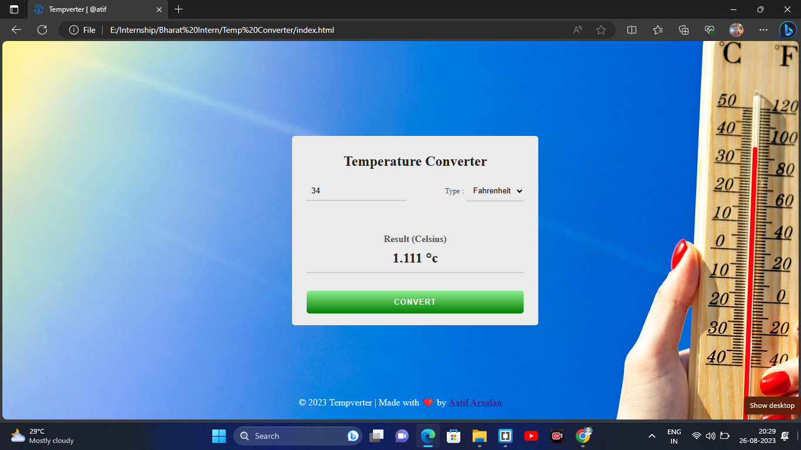

# BharatIntern_TempConverter

A temperature converter (Tempverter) is a tool used to convert temperatures, to and from Celsius, Fahrenheit, and Kelvin.

# Software_Requirements : 
IDE- Brackets

# Tech Stack:
HTML, CSS, Javascript and Bootstrap4

Show some ❤️ by starring this repo.!

